# Instagram (Acces token and Sandbox)  Guide
###### **Access Token** :- An Access token is an object that describes the security context of a process or thread. The information in a token includes the identity and privileges of the user account associated with the process or thread. Every developer is required to generate their own access token before he/she can access the various features of the API. **It is the Key to the API.**

## Pre-requisites
1. All you need is an instagram account.

## Getting Started
* Open your instagram account on the web and then go to the [__instagram developer page .__](https://www.instagram.com/developer/)
* You will see a page somewhat like this .
<br>

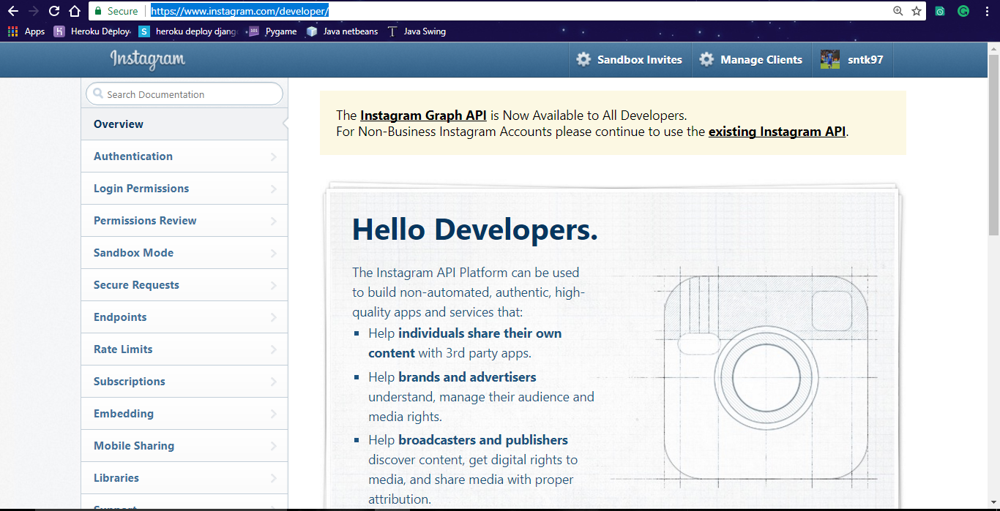
  * **Note:-** If not already logged in, login in using your existing instagram account.


* Next , you need to go to the manage clients page , by clickking on the manage clients button given at the top . You will see a page as shown below , here you can manage , create and delete clients.
<br><br>
 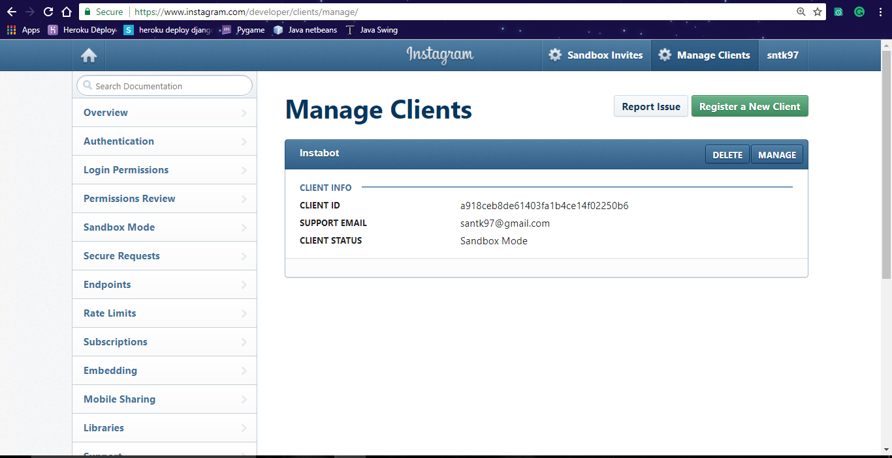
 <br><br>

* Now , we will register our app with Instagram , For that we will __Register a new Client__ **_by clicking on the green button_** just below the header on the right.
.
 <br><br>
 

 * Now , you will see a form you need to fill to register your client . Fill out this form and hit register .
  <br><br>
 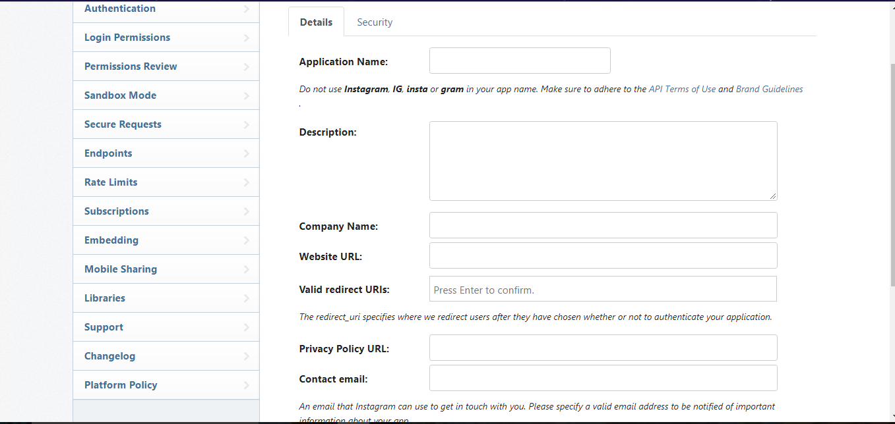
 <br><br>
 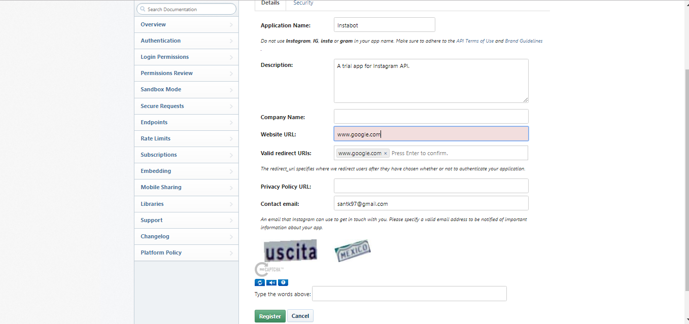

 <br><br>__Now , Hit the Register Button__

```python
Note : Form Explanation

Application Name : This is the name of the App That u are making.
Desription : Short desciption for your app .
Valid redirect Urls and Website URL : These are used for redirecting the page when creating the Acces token .
The valid url in the Valid redirect URIs field Can be any Valid Url You can also Choose anyone From here..
Ex: www.acadview.com, https://acadview.com,http://www.google.com

```
<br><br>

* Now , after Succesfully filling out the form you will be redirected to the *Manage Clients Page.* It will be display all of your apps .
 <br><br>
 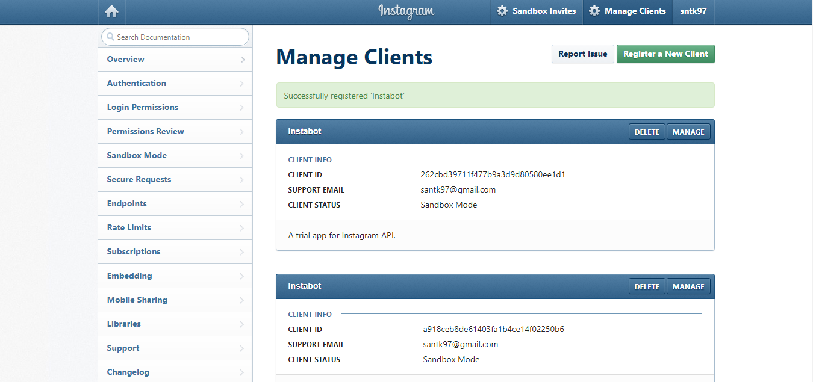
 <br><br>
 * Now , click the __*Manage*__ button and after that you need to change the Settings part a bit . So , go to the Settings tab and uncheck the __*Disable implicit OAuth*__ .
 <br><br>
 
 <br><br>
 * Updtae the settings .
 <br> <br>
 * __Now , We will generate the acces token .__
<br><br>
 1.   We Will use the following link to generate our *Access Token*.


 ```
https://api.instagram.com/oauth/authorize/?client_id=CLIENT-ID&redirect_uri=REDIRECT-URI&response_type=token&scope=basic+public_content+likes+comments

**NOTE: You will need to replace the CLIENT_ID and REDIRECT_URI with appropriate values.
```
<br><br>
2. You can get the **_CLIENT_ID_** from the manage clients page.

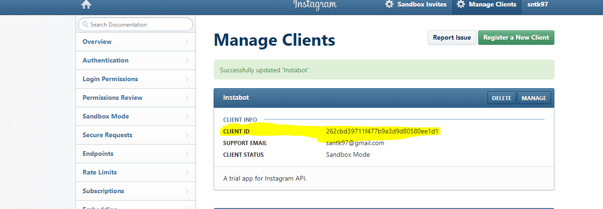
<br><br>
3. The __REDIRECT_URI__ part is the *redirect url* we entered in our form .
*In our case it is:*
 ```python
http://www.google.com
```

4. Now we will put both values in the link we talked about in the first point. Your link will look somewhat like this now .

```python
https://www.instagram.com/oauth/authorize/?client_id=262cbd39711f477b9a3d9d80580ee1d1&redirect_uri=http://www.google.com&response_type=token&scope=basic+public_content+likes+comments

**NOTE: notice how the client_id and the redirect_uri have been updated
```
<br><br>
5. Enter This URL and then you will be redirected to a page like this .<br><br>
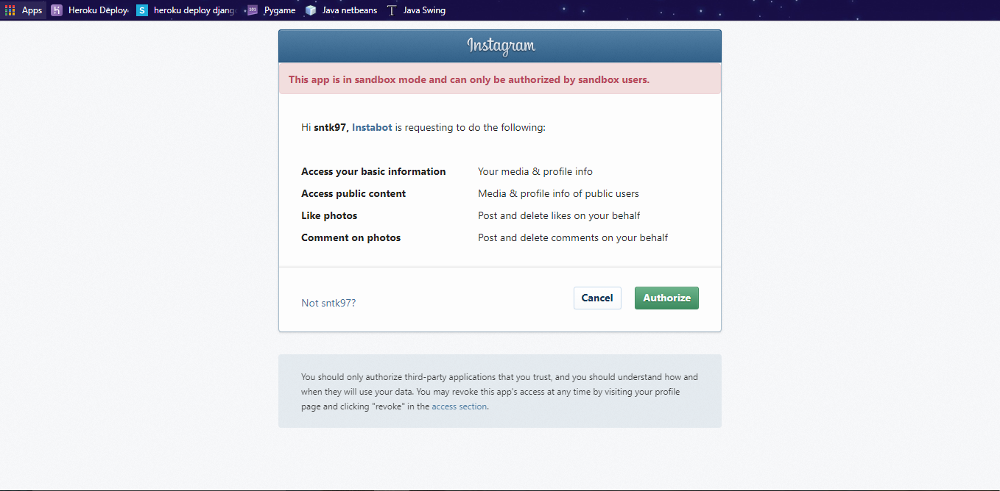
<br><br>
6. Click the __*Authorize*__ Button.
<br><br>
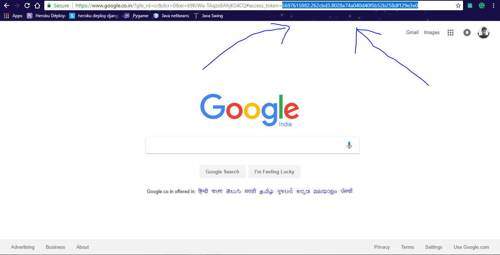
 <br><br>
 7. __The Acces Token Has been Generated .__
 __Save This in  A Text file For Further uses .__
 <br><br>
 8. Now Adding user to **Sandbox**.
 <br><br>
 9. Now click **Manage Clients** in the developer page and then **Manage**
 <br><br>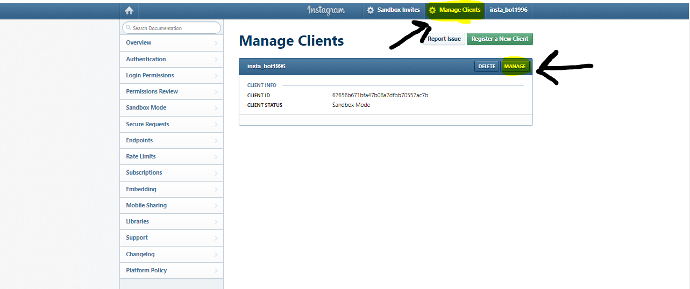
 <br><br>
 10.Click on the sandbox in manage client
 <br><br>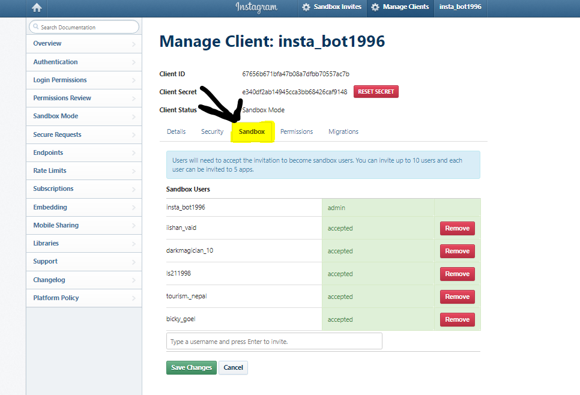
 <br><br>
 11. You can add **10** User in your sandbox and each user can be invited to **5** apps.
  <br><br>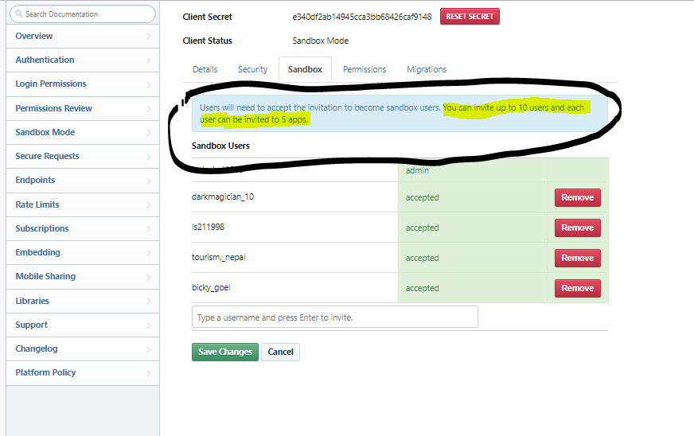
 <br><br>
 12. Type valid User name and send request to addup in sanbox
 <br><br> 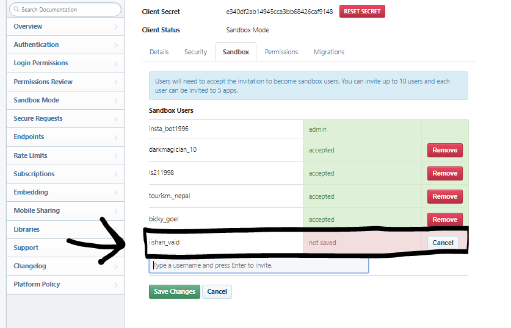
 <br><br>
 13. Same as the different user want you to add in Sandbox it will appear in **Sandbox invites** in Header.Click **Sandbox Invites**.
 <br><br>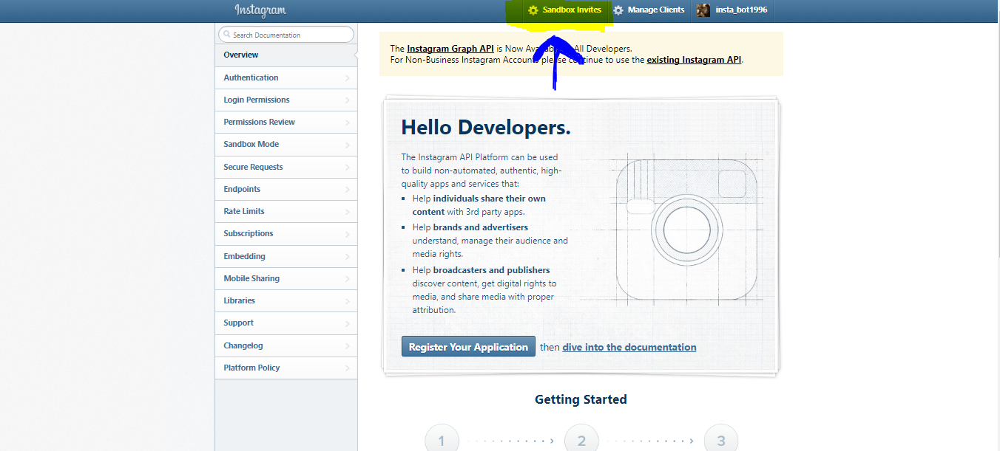
<br><br>
 14. Request to add in Sandbox will appear like this,Click **Accept** to  add in your Sandbox.
 <br><br>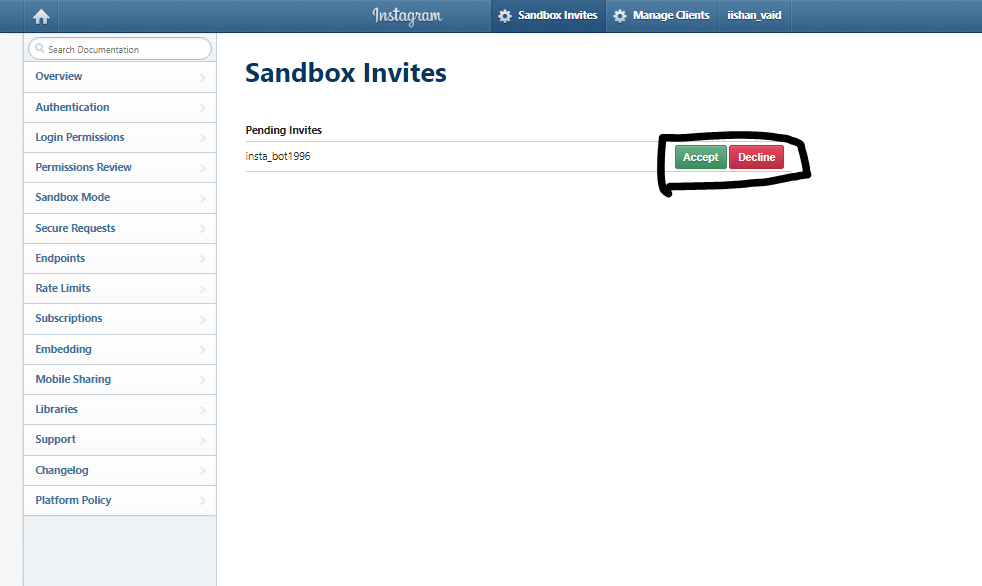
 <br><br>
 15.Accepted sandbox invites will appear with user name.
<br><br> 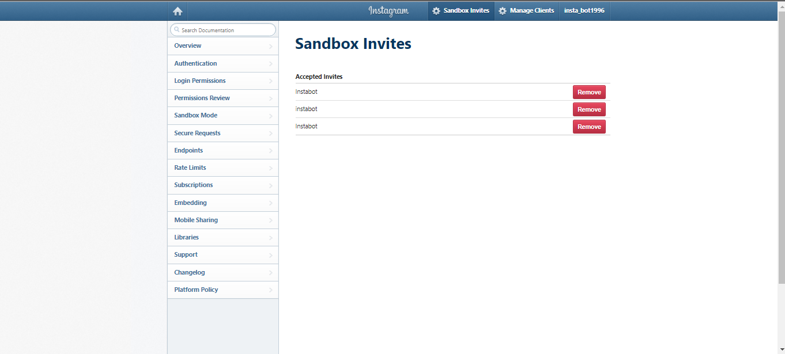
 <br><br>
 <br><br>16. You have Sucessfully add a user in your Sandbox.
